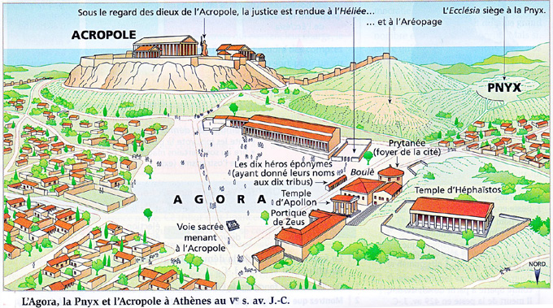

<!--
_backgroundColor: #708090
_color: #F5FFFA
-->

## HLP philo   <!-- fit -->
# Spécialité *classe*  <!-- fit -->
# *Titre leçon*  <!-- fit -->

---

<!-- paginate: true -->

## 1. 

### 1.1 
 
 

[→ Fiche "Philosophie, Sophistique et rhétorique](https://github.com/rollauda/hlp/blob/main/assets/pdf/Philosophie_rh%C3%A9torique.pdf)

---
## 2. 

---
<!--
_backgroundColor: black
_color: #F5FFFA
-->
### Titre vidéo
 
 
<iframe width="800" height="450" src="https://www.youtube.com/embed/Wvdy0UQNO9E" title="YouTube video player" frameborder="0" allow="accelerometer; autoplay; clipboard-write; encrypted-media; gyroscope; picture-in-picture; web-share" allowfullscreen></iframe>

---
### Titre audio 

<audio src="../../assets/audio/Socrate.mp3" controls preload></audio>

