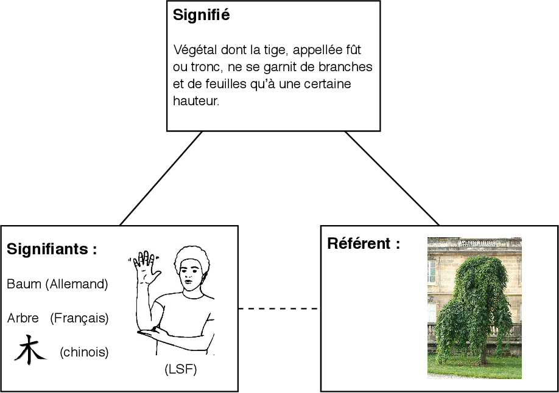

<!--
_backgroundColor: #708090
_color: #F5FFFA
-->

## HLP philosophie   <!-- fit -->
# Spécialité Première  <!-- fit -->

 

## THÈME 1 : Les pouvoirs  de la parole   <!-- fit -->
## LEÇON 1 : Pourquoi parle-t-on ? <!-- fit -->

---

<!-- paginate: true -->

### Pourquoi parle-t-on ? Analyse de la question

* **"ON"** ?
  * Qui ?
  * Tous les animaux, où seulement mes êtres humains ?
* **"PARLE"** ?
  * Qu'est-ce que parler ?
  * = Communiquer des informations, ou exprimer des idées ?
* **"POURQUOI"** ?
  * Quelles sont les fonctions du langage ? À quoi sert-il ?
* **=> PROBLÉMATIQUE :** La parole distingue-t-elle l’être humain des autres animaux ? À quoi nous sert la parole ? Quelles sont les fonctions du langage ?

---

## 1. Qui parle ?

 

#### Les animaux parlent-ils, où l’être humain est-il le seul à en être capable ?

 

#### Par exemple, le cri d’une souris ou le chant d’un oiseau est-il l’équivalent d’une parole humaine ? Peut-on parler de “langage” chez les animaux ?

---

 ### 1.1. Quelques éléments de linguistique

| Langage | Langue  | Voix | Parole |
|:-------------:|:------------:|:-------------:|:-------------:|
| **Capacité à exprimer ses pensées à autrui à l'aide de signes (mots, gestes, etc.).**   Le langage est une faculté universelle, propre à tous les membres de l'espèce humaine.  | **Système de signes propre à une société** (ex: le Quechua) ou un groupe de personnes (ex: la Langue des signes).     Si le langage est universel, il contient un très grand nombre de langues. | **Capacité physiologique à émettre des sons.**                Le larynx est l'organe de la parole : il contient les « cordes vocales » qui vibrent au passage de l'air et permettent d'articuler des sons.|  **Capacité à s’exprimer avec des mots.**              On peut être sans voix  (ex: les muets) mais transcrire une parole à l’aide de signes où à l’écrit. | 

---

<!--
_backgroundColor: white
-->

#### Signifiant et signifié

Le langage est constitué de `signes` (par exemple des mots) qui désignent des choses, et qui sont différents d’une langue à l’autre. 

Les `signes` ont des `référents`, la réalité qu’ils désignent.

Le `signe` se décompose en une face matérielle, le `signifiant`, et une face mentale, le `signifié`.

---
<!--
_backgroundColor: white
-->

#### Explication
1) Le signifiant est l'enveloppe matérielle du signe, par exemple le mot écrit, ou parlé grâce à la voix, ou exprimé en langue des signes : ARBRE.
2) Le signifié est l’idée ou le concept d'arbre (l'arbre dans mon esprit).
3) Le référent est l'arbre réel.

---
<!--
_backgroundColor: white
-->

---

### 1.2. Les animaux non-humains parlent-ils ?

 

* Le cri d’un animal est-il un mot, donc un signe ?
* La plupart du temps, il s’agit plutôt d’un signal : l’animal ressent quelque chose (une douleur, un désir), il le communique aux autres (un cri, un chant).
* Pour être un signe, le cri doit renvoyer à un signifié, c’est-à-dire une image mentale.
* Pour qu’il y ait un langage animal, il faut donc que l’animal pense et exprime des idées.

---

#### LANGAGE ≠ COMMUNICATION

 

* **Langage**
  * Exprime une idée à l'aide de `signes`. Ex : une phrase, un poème
  * Provoque une `réponse`. Ex : une conversation, une émotion.
* **Communication**
  * Transmet un `signal` : un cri, ou une publicité
  * Provoque une `réaction`. Ex : de l'aide, un achat

---
<!--
_backgroundColor: black
_color: #F5FFFA
-->
#### Extrait du documentaire “Les animaux pensent-ils ?”

<iframe width="800" height="450" src="https://www.youtube.com/embed/YQZPqvEJtEw?start=772" title="YouTube video player" frameborder="0" allow="accelerometer; autoplay; clipboard-write; encrypted-media; gyroscope; picture-in-picture; web-share" allowfullscreen></iframe>

---

## 2. Pourquoi les êtres humains parlent-ils ?

**Exercice évalué : Lire les quatre textes de la fich-leçon et répondre aux questions suivantes :**
1. Pourquoi les êtres humains parlent-ils ? Après avoir étudié au brouillon les 4 textes, reproduire et remplir ce tableau de synthèse en résumant chaque thèse en une phrase.

 | |  |
|:-------------:|:------------:|
 | ARISTOTE | ROUSSEAU  |
| Réponse en une phrase | Réponse en une phrase  |
| NIETZSCHE | DESCARTES  |
| Réponse en une phrase | Réponse en une phrase  |

---

2. Selon vous, lesquels de ces 4 philosophes considèrent que seuls les êtres humains parlent ? Lequel pense le contraire ? Justifiez votre réponse.

 | Utilisez la structure ci-dessous| 
|:-------------:|
 | A, B et C pensent que seul l'être humain parle. 
A affirme en effet que…  etc.
B, de son côté, pense que… etc.
Enfin, C montre que… etc.
D pense que les animaux sont eux aussi capables de parler. 
Il explique que…  etc. | 

