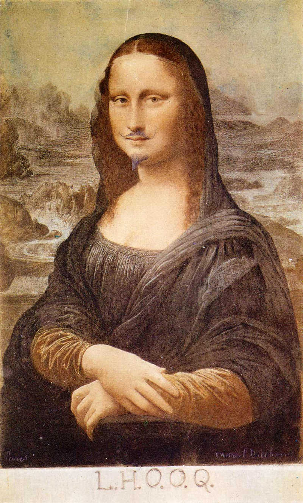
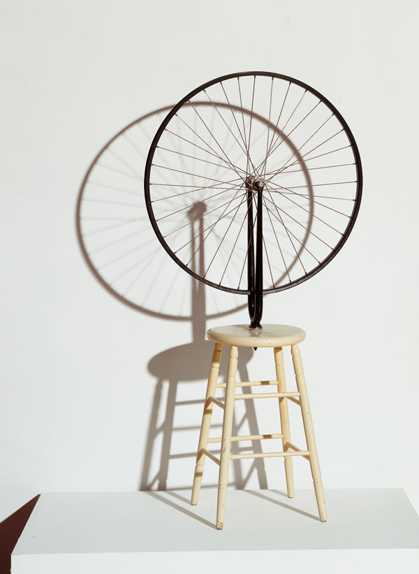
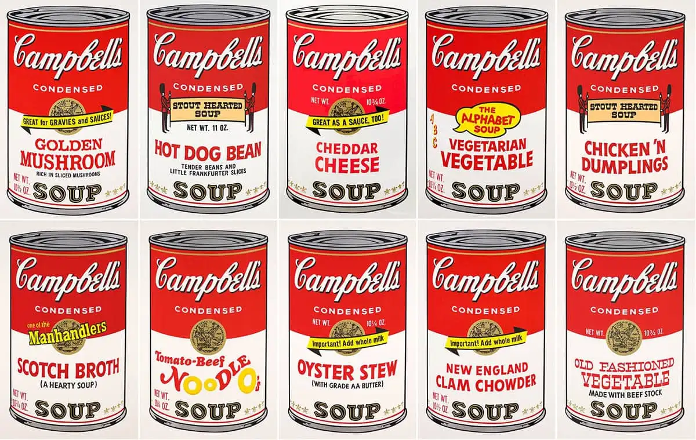

## 2.2. L’art contemporain, un art de la rupture

| Marcel Duchamp, *Du champ du signe*, 1975     | 
| ------------------------- | 
| Ce qui ne va pas en art dans ce pays aujourd'hui, et apparemment en France aussi, c'est qu'il n'y a pas d'esprit de révolte - pas d'idées nouvelles naissant chez les jeunes artistes. Ils marchent dans les brisées de leurs prédécesseurs, essayant de faire mieux que ces derniers. En art, la perfection n'existe pas. Et il se produit toujours une pause artistique quand les artistes d'une période donnée se contentent de reprendre le travail d'un prédécesseur là où il l'a abandonné et de tenter de continuer ce qu'il faisait. D'autre part, quand vous choisissez quelque chose appartenant à une période antérieure et que vous l'adaptez à votre propre travail, cette démarche peut être créatrice. Le résultat n'est pas neuf mais il est nouveau dans la mesure où il procède d'une démarche originale. | 
| *1. Expliquez ce que doit être « *l’esprit de révolte* » de l’artiste, selon Duchamp.*   *2. En quoi ces deux œuvres illustrent-elles les propos de Duchamp ?* |  

|     |     | 
| Marcel Duchamp, _L.H.O.O.Q._, 1919     |  Marcel Duchamp, _Roue de bicyclette_ (1913)         |

| « *L’art est une chose beaucoup plus profonde que le goût d’une époque.  Le goût est une source de plaisir, l’art n’est pas une source de plaisir, c’est une source qui n’a pas de couleur, pas de goût. Le grand ennemi de l’art, c’est le bon goût.* »   « *Lorsque quelqu’un s’avise de mettre cinquante boîtes de soupe Campbell sur une toile, ce n’est pas le point de vue optique qui nous préoccupe. Ce qui nous intéresse, c’est le concept qui fait mettre cinquante boîtes de Campbell sur une toile.* »   **Marcel Duchamp** | 

|     |
| _Campbell's Soup_, Andy Warhol, 1962          |