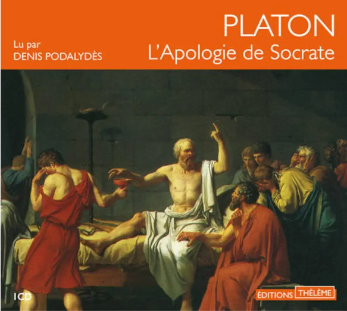

## 3. Socrate, le premier philosophe
{: .no_toc }

  

    Sommaire
  

  {: .text-delta }
- TOC
{:toc}

## 3.1. Socrate et Platon
- Qui étaient Socrate et Platon ?
- Comment et pourquoi Socrate a-t-il été condamné à mort ?  

**→ Qu'est-ce que l'Oracle de Delphes ?** 
<iframe width="560" height="315" src="https://www.youtube.com/embed/Wvdy0UQNO9E" title="YouTube video player" frameborder="0" allow="accelerometer; autoplay; clipboard-write; encrypted-media; gyroscope; picture-in-picture; web-share" allowfullscreen></iframe>

## 3.2. Extrait de l'Apologie de Socrate (Platon)

<audio src="../../assets/audio/Socrate.mp3" controls preload></audio>

## 3.3. Texte de Platon : l'enquête de Socrate
**Polycopié de la leçon : lire le texte et répondre...**  
1. La Pythie est la prêtresse et l'oracle d'Apollon. Elle livre des prophéties aux Athéniens qui viennent la consulter. Pourquoi Socrate est-il étonné de sa réponse à Chéréphon ? Comment réagit-il à cette réponse ?
2. Quelle découverte Socrate fait-il après son enquête auprès des savants athéniens ?
3. En quoi la dernière phrase du texte pourrait être une définition de la philosophie ?

**Complément : émission d'Arte sur Socrate**
<iframe width="560" height="315" src="https://www.youtube.com/embed/A1ObiQfww5k" title="YouTube video player" frameborder="0" allow="accelerometer; autoplay; clipboard-write; encrypted-media; gyroscope; picture-in-picture; web-share" allowfullscreen></iframe>